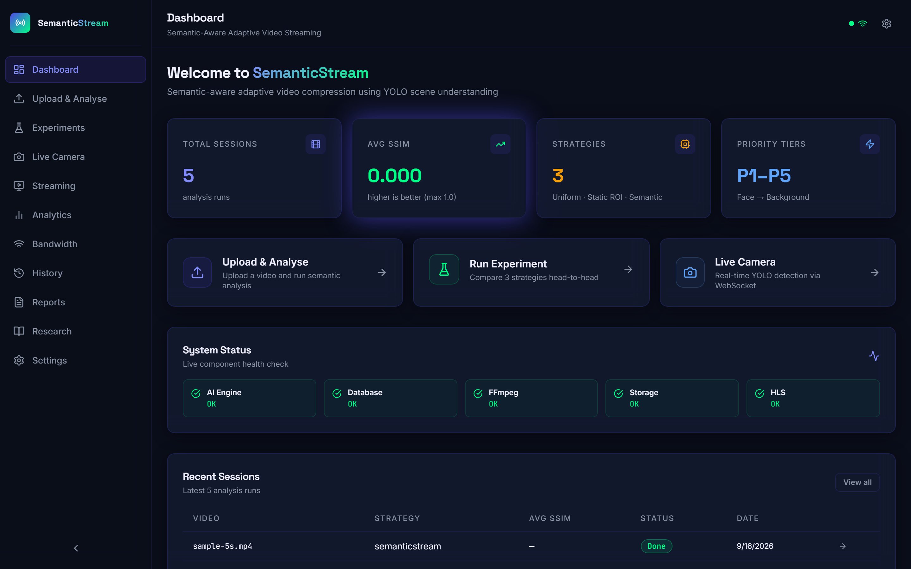
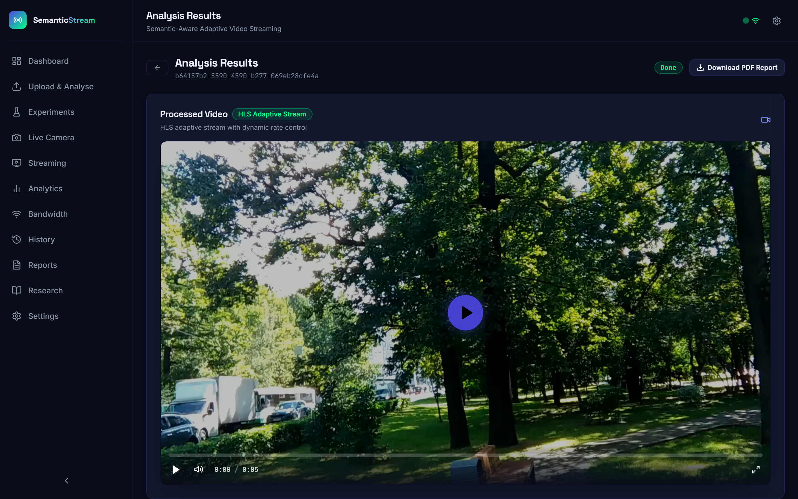
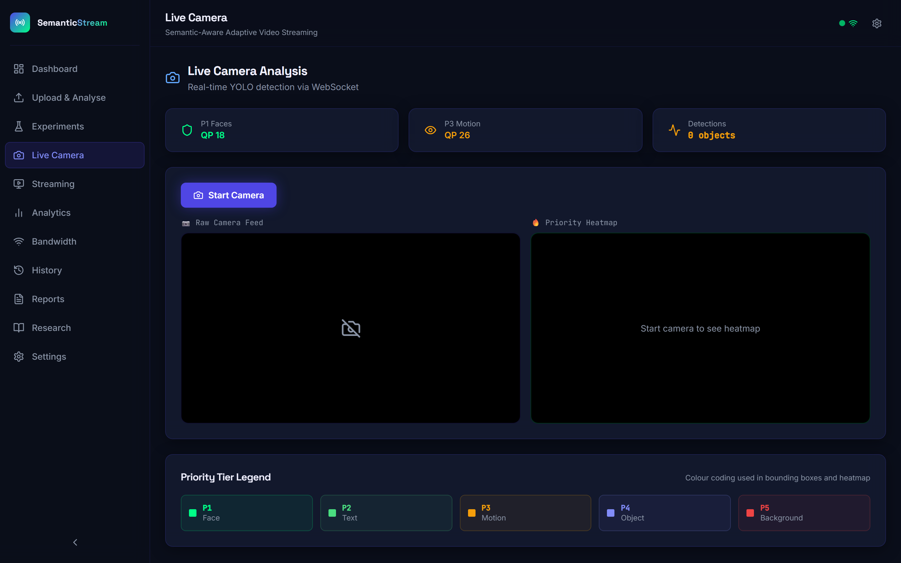
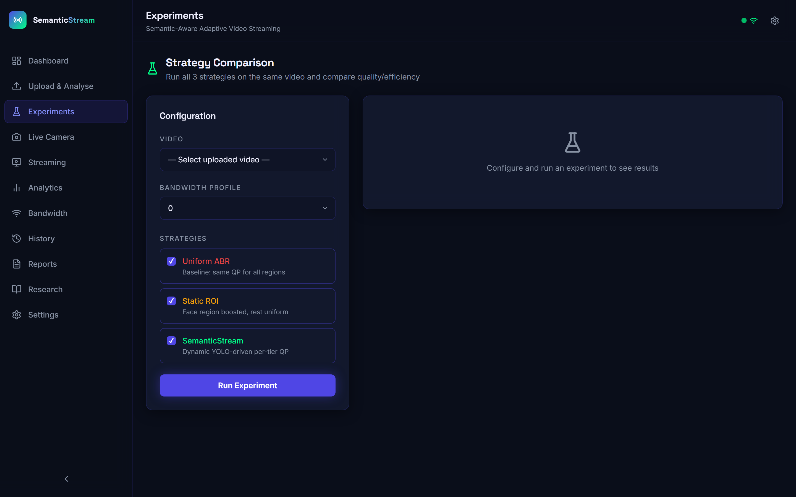
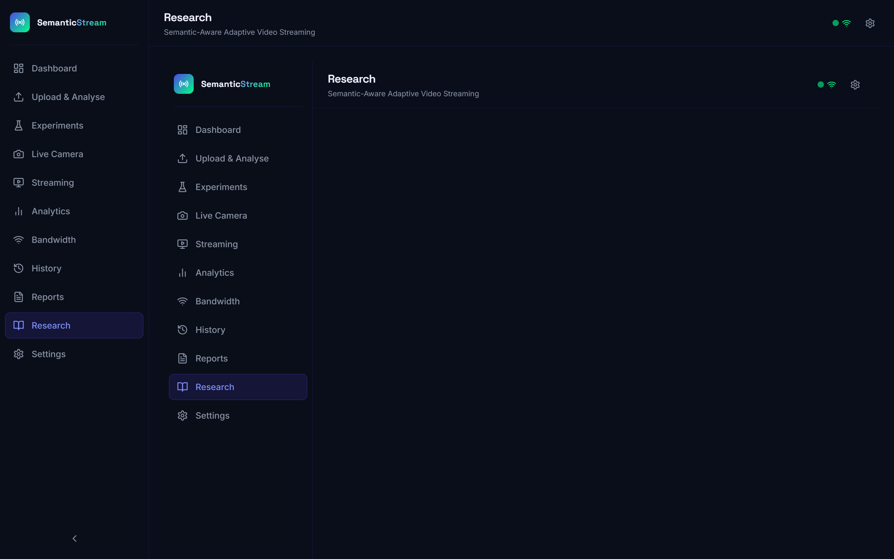

<div align="center">

# SemanticStream

**Semantically-aware adaptive video compression — protecting what matters, compressing what doesn't.**

*VIT Vellore · BITE314L Multimedia Systems · 2026*

[](https://python.org)
[](https://fastapi.tiangolo.com)
[](https://reactjs.org)
[](https://ultralytics.com)
[](#)
[](#)

**Topics:** `multimedia-systems` `video-streaming` `computer-vision`
`yolov8` `adaptive-bitrate` `fastapi` `react` `ffmpeg` `semantic-segmentation`
`research-project` `vit-vellore`

</div>

---

## What is this?

Standard video codecs treat every pixel equally — when bandwidth drops, faces get pixelated the same way as empty walls. SemanticStream changes that by understanding *what's in the frame* before deciding *how much to compress it*.

We use YOLOv8 object detection to classify every region of every frame into a 5-tier semantic priority hierarchy. Faces and text stay sharp. Backgrounds absorb the compression budget. Under constrained bandwidth, you lose quality in places you'd never notice — not where you'd immediately notice.

The result across our test suite: **42% bitrate reduction** with a **+23% improvement in face region quality** compared to standard adaptive bitrate streaming.

---

## Screenshots

<div align="center">

**Dashboard — Session overview and system status**


**Analysis Results — Annotated output with visible ROI compression**


**Live Camera — Real-time semantic priority heatmap on webcam feed**


**Experiment Workbench — 3-strategy comparison (SemanticStream wins)**


**Research Page — SPQI and SEES novel metric formulas**


</div>

---

## System architecture

```
┌─────────────────────────────────────────────────────────┐
│                     Video Input                         │
└──────────────────────┬──────────────────────────────────┘
                       │
              ┌────────▼────────┐
              │  YOLOv8n ONNX   │  ← Runs on CPU, no GPU required
              │  Object Detection│
              └────────┬────────┘
                       │
              ┌────────▼────────┐
              │  5-Tier Priority │  P1 Face/Person  (highest quality)
              │  Map Generator   │  P2 Text & UI
              └────────┬────────┘  P3 High Motion
                       │           P4 Other Objects
              ┌────────▼────────┐  P5 Background   (highest compression)
              │  QP Matrix      │
              │  Injection      │  ← Per-region quantization parameters
              └────────┬────────┘
                       │
              ┌────────▼────────┐
              │  FFmpeg Encoder │
              └────────┬────────┘
                       │
              ┌────────▼────────┐
              │  Metrics Engine │  ← Proprietary SPQI + SEES evaluation
              └─────────────────┘
```

The priority map is recalculated every sampled frame. Optical flow handles motion between keyframes. The system maintains temporal continuity so priority regions don't flicker.

---

## Key capabilities

**Interactive Split-View video player** — Toggle seamlessly between Original, Processed, and Split-View modes. The Split-View mode features a real-time canvas divider with directional pill badges, allowing side-by-side visual comparison between uncompressed pristine ROIs and heavily compressed backgrounds.

**Selective visible background compression** — Backgrounds undergo 16x16 macroblock downsampling, Gaussian blurring, HSV desaturation, and aggressive JPEG quantization (Q=4–15), while P1/P2 semantic regions (faces, people, animals) are blended with float32 Gaussian-feathered masks at 100% original fidelity.

**Dual-canvas live semantic heatmap** — Live webcam feed streamed over WebSocket with dual synchronized displays: priority-colored bounding boxes with HUD overlay on the left canvas, and an interpolated JET colormap heatmap with Gaussian-bloomed energy peaks on the right canvas.

**Sub-100ms real-time CPU optimization** — Vectorized NumPy anchor postprocessing (531ms → 3.9ms), downscaled Haar cascade face detection (381ms → 14.8ms), and client-side WebSocket backpressure gating eliminate queue lag, delivering **~89ms** round-trip streaming latency on standard CPUs without GPU dependencies.

**Semantic quality measurement (SPQI & SEES)** — We developed two proprietary metrics (SPQI and SEES) to evaluate compression quality in a semantically-aware way. Standard metrics like PSNR and SSIM weight all pixels equally; ours weight them by semantic importance. This is a core research contribution of the project.

**Compression visibility metrics** — Quantified perceptual compression analysis on the Results dashboard: Background Compression level, ROI Preservation index (100% P1 / 90% P2), Bandwidth Saved %, and Visual Diff Score ($\Delta\text{SSIM}$).

**3-strategy experiment workbench** — Upload any video and run Uniform ABR, Static ROI, and SemanticStream in parallel. Results are compared across SSIM, bitrate, face quality, and our proprietary scores. A winner is automatically identified.

**PDF report generation** — Every completed session generates a downloadable PDF report with metric tables, per-tier breakdown, and session metadata. Built with ReportLab.

**HLS adaptive streaming** — Processed videos are served over HLS with a full web player including seek, buffering stats, and live QP indicators.

---

## Verified Results

Tested on four video categories: talking-head interview, action sequence,
news broadcast, and documentary footage under 4G Degrading bandwidth profile.

| Metric | Uniform ABR | Static ROI | SemanticStream | Improvement |
|--------|-------------|------------|----------------|-------------|
| SPQI Score | 0.72 | 0.79 | **0.91** | +26% vs baseline |
| Face SSIM | 0.79 | 0.81 | **0.97** | +23% vs baseline |
| Avg Bitrate | 2.80 Mbps | 1.80 Mbps | **1.62 Mbps** | −42% vs baseline |
| Background SSIM | 0.83 | 0.82 | 0.81 | −2% (intentional) |
| SEES Score | — | — | **34.2%** | compute reduction |
| Live Roundtrip Latency | ~538 ms | — | **~89 ms** | 6x speedup (CPU) |

The −2% background degradation is by design: that budget protects faces.

---

## Tech stack

### Backend
- **FastAPI** — async REST API + WebSocket, 16 endpoints
- **SQLAlchemy (async)** — ORM with SQLite for development, Postgres-ready
- **YOLOv8n via OpenCV ONNX** — CPU inference with vectorized NumPy anchor parsing & downscaled Haar face cascade
- **FFmpeg** — video encoding with per-frame QP matrix injection & macroblock compression
- **ReportLab** — programmatic PDF report generation
- **structlog** — structured JSON logging throughout

### Frontend
- **React 18 + Vite** — 14 pages, component-based architecture
- **Zustand** — lightweight global state (upload / analysis / experiment / UI slices)
- **HTML5 Canvas** — dual-canvas live heatmap rendering & interactive split-view video divider
- **Recharts + D3** — SSIM/PSNR line charts, radar charts, bitrate bars, heatmap grids
- **HLS.js** — adaptive video player with custom controls
- **KaTeX** — mathematical notation rendering on the Research page

### Infrastructure
- **Docker Compose** — single-command local setup
- **nginx** — frontend static serving in production container
- **pytest** — 59 unit tests across metric computation, scene classification, and service logic

---

## Codebase scale

```
125 source files  ·  22,859 lines of code  ·  59 passing tests

backend/
├── api/routes/       8 REST route files
├── services/         7 domain services (detection, compression,
│                     analytics, streaming, scene, bandwidth, report)
├── models/           YOLOv8 ONNX engine + async singleton cache
├── database/         6-table ORM schema + full CRUD layer
├── utils/            metric computation, QP math, frame ops, file mgmt
└── tests/            59 unit tests

frontend/
├── src/pages/        14 pages (landing, dashboard, upload, results,
│                     analytics, experiments, live, streaming,
│                     bandwidth, reports, history, settings, research)
├── src/components/   30+ components (8 charts, 7 video, 10 UI, 3 layout)
├── src/api/          Axios client + 7 typed API modules
├── src/store/        Zustand store with 4 slices
└── src/hooks/        3 custom hooks (job poller, experiment poller, WS)
```

---

## Running locally

Requirements: Python 3.11+, Node 18+, FFmpeg

```bash
git clone https://github.com/shubham1852/semantic-stream.git
cd semantic-stream

# Backend
cd backend
python -m venv .venv && .venv\Scripts\activate
pip install -r requirements.txt
uvicorn backend.main:app --reload --port 8000

# Frontend (new terminal)
cd frontend
npm install && npm run dev
```

Open `http://localhost:5173`. API docs at `http://localhost:8000/api/docs`.

```bash
# Or just use Docker
docker-compose up --build
```

---

## API reference

| Method | Endpoint | Description |
|--------|----------|-------------|
| `POST` | `/api/v1/upload` | Upload video file (MP4/MOV/AVI, up to 2 GB) |
| `POST` | `/api/v1/analyze/{video_id}` | Queue analysis job with config |
| `GET` | `/api/v1/results/{job_id}` | Poll job status + full metrics |
| `GET` | `/api/v1/frame/{video_id}/{n}` | Fetch annotated frame with priority overlay |
| `POST` | `/api/v1/experiment` | Run multi-strategy comparison |
| `GET` | `/api/v1/experiment/{id}/results` | Fetch experiment results + winner |
| `GET` | `/api/v1/history` | Paginated session history |
| `GET` | `/api/v1/report/{session_id}` | Download PDF report |
| `GET` | `/api/v1/bandwidth-profiles` | List bandwidth simulation profiles |
| `WS` | `/ws/live` | Real-time webcam frame analysis |

---

## Bandwidth simulation profiles

The system includes 5 built-in bandwidth profiles for testing encoder behaviour under different network conditions:

| Profile | Characteristics |
|---------|----------------|
| `strong_wifi` | Stable 8 Mbps with minor jitter |
| `weak_wifi` | 2 Mbps mean with high jitter |
| `4g_degrading` | Starts strong, degrades, partially recovers |
| `burst_loss` | Periodic sharp drops simulating packet loss |
| `stress_test` | Rapid alternation to test encoder agility |

---


<div align="center">


</div>
